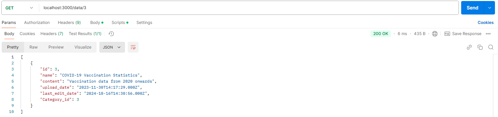

# Тестування системи

- Тестування працездатності системи
    - [Основний сценарій для Data](#основний-сценарій-для-data)
        - [GET](#get-data)
        - [POST](#post-data)
        - [PUT](#put-data)
        - [DELETE](#delete-data)
    - [Основний сценарій для Access](#основний-сценарій-для-access)
        - [GET](#get-access)
        - [POST](#post-access)
        - [PUT](#put-access)
        - [DELETE](#delete-access)
    - [Виключні ситуації для Data](#виключні-ситуації-для-data)
        - [GET](#get-data-error)
        - [POST](#post-data-error)
        - [DELETE](#delete-data-error)
    - [Виключні ситуації для Access](#виключні-ситуації-для-access)
        - [GET](#get-access-error)
        - [POST](#post-access-error)
        - [DELETE](#delete-access-error)

## Основний сценарій для Data
### GET Data
Get-запит на отримання всіх даних

Get-запит на отримання даних за id

### POST Data
Post-запит для додавання даних 

### PUT Data
Put-запит на оновлення name

### DELETE Data
Delete-запит на видалення даних

## Основний сценарій для Access
### GET Access
Get-запит на отримання всіх доступів

Get-запит на отримання доступу за id

### POST Access
Post-запит на додавання доступу

### PUT Access
Put-запит на оновлення access_type

### DELETE Access
Delete-запит на видалення категорії

## Виключні ситуації для Data
### GET Data Error
Немає даних із заданим id

### POST Data Error
Введено не всі дані, що є обов’язковими для заповнення

### DELETE Data Error
Немає даних із заданим id

## Виключні ситуації для Access
### GET Access Error
Немає доступу із заданим id

### POST Access Error
Введено не всі дані, що є обов’язковими для заповнення

### DELETE Access Error
Немає доступу із заданим id

